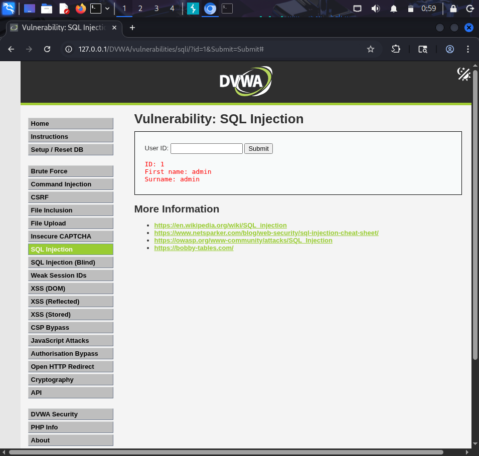
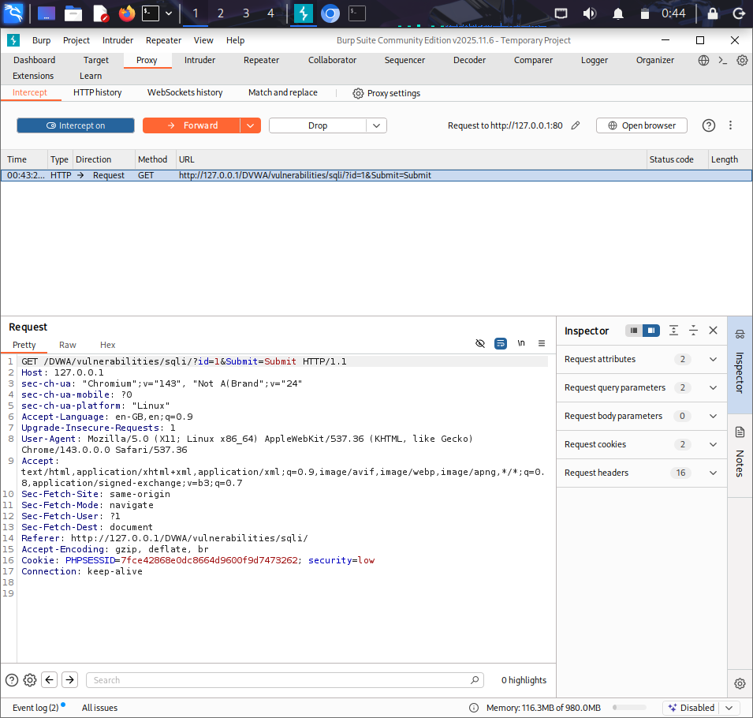
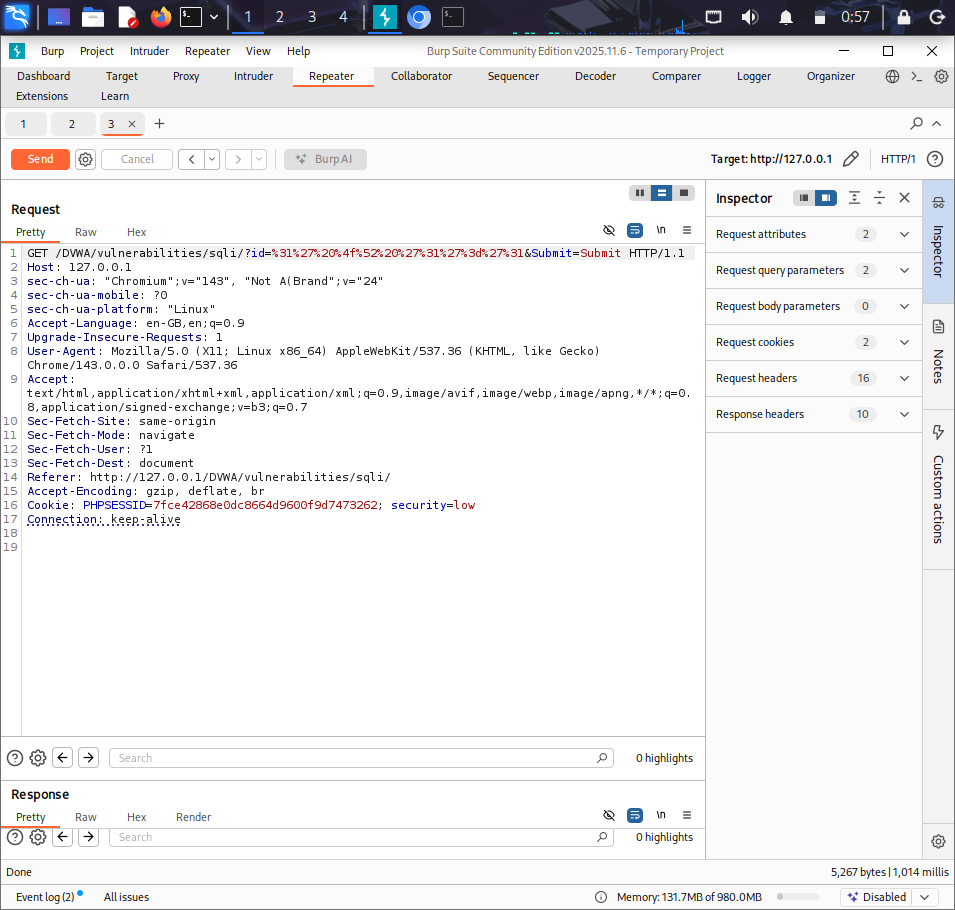
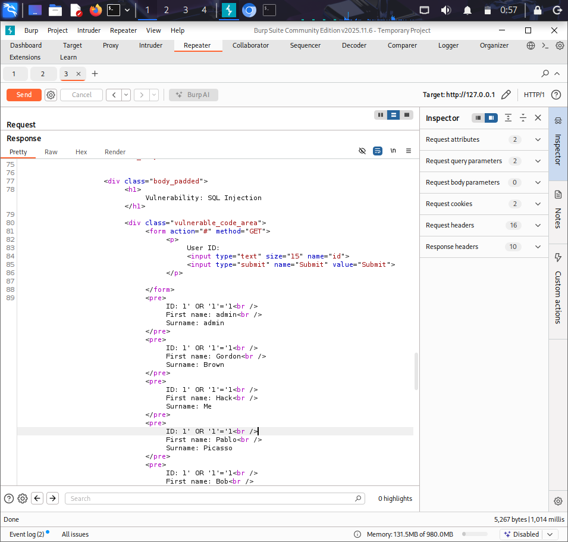

# 🛡️ Burp Suite Project 3 – SQL Injection (DVWA)

## 📌 Project Overview
This project demonstrates a successful SQL Injection attack using Burp Suite on the DVWA (Damn Vulnerable Web Application). The vulnerability allows retrieval of multiple user records by manipulating the SQL query.

## 🎯 Objective
- Identify SQL Injection vulnerability
- Exploit the vulnerability using crafted payloads
- Retrieve unauthorized data from the database

## 🛠️ Tools Used
- Burp Suite Community Edition
- Kali Linux
- DVWA (Damn Vulnerable Web Application)

## 💥 Result

The application returned multiple user records instead of a single user:

- admin / admin  
- Gordon Brown  
- Hack Me  
- Pablo Picasso  
- Bob Smith  

This confirms that the SQL query was successfully manipulated.

## 🔍 Key Finding
The application is vulnerable to SQL Injection. The injected condition (`'1'='1'`) always evaluates to TRUE, causing the database to return all records.

## ⚠️ Vulnerability Details
- No input validation
- Direct use of user input in SQL queries
- Susceptible to SQL Injection attacks

## 📸 Screenshots
- SQL Injection page

- Burp intercept

- Repeater request

- Extracted multiple records

## 🧠 Learning Outcomes
- Understanding SQL Injection attacks
- Using Burp Suite Repeater effectively
- Analyzing HTTP requests and responses
- Identifying web application vulnerabilities

## 🚀 Conclusion
This project demonstrates how improper input handling can lead to SQL Injection vulnerabilities, allowing attackers to access sensitive data from the database.
